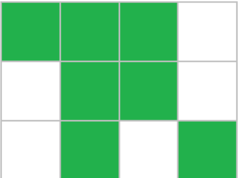

# Place of the Olympiad

### Time Limit

1 second

### Memory Limit

256 megabytes

---

### Description

For the final of the first Olympiad by IT Campus **"NEIMARK"**, a rectangular venue was prepared.

You may assume that the venue is divided into `n` rows, each containing `m` spots for participants' desks. A total of `k` participants have registered for the final, and each participant will sit at an individual desk. Now, the organizing committee must choose the locations for the desks in the venue.

Each desk occupies one of the `m` spots in a row. Moreover, if several desks occupy consecutive spots in the same row, we call such a group of desks a **bench**, and the number of desks in the group is the **bench's length**.

---

### Example Explanation

For example, seating `7` participants in a `3 × 4` venue (`n = 3`, `m = 4`) can be arranged as follows:



In the figure above:

- The **first row** has one bench of length `3`
- The **second row** has one bench of length `2`
- The **third row** has two benches of length `1`

---

The same `7` desks can be arranged in a more optimal way so that the lengths of **all benches do not exceed `2`**:


---

### Objective

The organizing committee wants to choose the desk locations such that the **length of the longest bench is minimized**.

Given integers `n`, `m`, and `k`, determine the **minimum possible length of the longest bench**.

---

### Input

Each test contains multiple test cases.

- The first line contains an integer `t` — the number of test cases  
  `(1 ≤ t ≤ 10⁴)`

- Each of the following `t` lines contains three integers:

  - `n` — number of rows
  - `m` — number of spots per row
  - `k` — number of participants

  `(1 ≤ n, m, k ≤ 10⁹, k ≤ n · m)`

---

### Output

For each test case, output a single integer — the **minimum possible length of the longest bench**.

---

### Example

#### Input

```text
5
3 4 7
5 5 5
1 13 2
2 4 7
1 5 4
```

#### Output

```text
2
1
1
4
2
```
